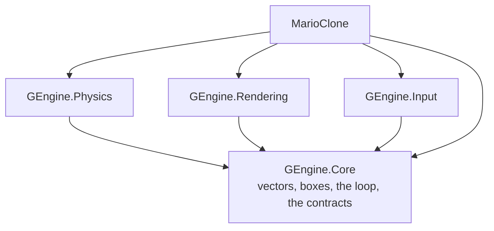

# gengine

A 2D game engine that draws in a terminal, with its own physics, its own gamepad driver, and a
Mario clone to prove it works. Written in C# on .NET 10, with **zero NuGet packages** — the base
class library, the SDK's analyzers, and nothing else.

It is a course as much as a codebase. Every decision that could have gone another way is written
down next to the code that made it, in the file that made it. If you want to know how a game loop
holds sixty frames a second, how a swept box stops tunnelling through a wall, or how a DualSense
report is decoded byte by byte, the answer is in here and it is short.

**What it is not**: fast, three-dimensional, or ready for your game. There is no sound, no
networking, no editor, and the display is eighty characters wide. The whole point is that
everything it does do, it does in code you can read in an afternoon.

```
++++++++++++++++++++++++++++++++++++++++++++++++++++++++++++++++++++++++++++++++++++++++++++++++
++++++++++++++++++++++++++++++++++++++++++++++++++++++++++++++++++++++++++++++++++++++++++++++++
+++@@@+++@@@+++@@@+++@@@+++@@@+++@@@+@+++++++++++@+@@@+++@@@@@@+++@@@+++@@@++++++++++++++@@@@@++
++@+++@+@+++@+@+++@+@+++@+@+++@+@+++@@++++++++++@@@+++@+@++@@++@+@+++@+@+++@++++++++++++++++@+++
++@++@@+@++@@+@++@@+@++@@+@++@@+@++@@@++++++@+++@@@++@@+@++@@++@+@+++@+++++@+++++++@+++@+++@++++
++@+@+@+@+@+@+@+@+@+@+@+@+@+@+@+@+@+@@+++@@@@@+@+@@+@+@+@+@+@+@+++@@@@++++@+++++++++@+@+++++@+++
++@@++@+@@++@+@@++@+@@++@+@@++@+@@++@@++++++++@++@@@++@+@@++@@+++++++@+++@+++++++++++@+++++++@++
++@+++@+@+++@+@+++@+@+++@+@+++@+@+++@@+++++++@+@+@@+++@+@+++@+++++++@+++@+++++++++++@+@++@+++@++
+++@@@+++@@@+++@@@+++@@@+++@@@+++@@@@@@+++++@+++@@@@@@+++@@@@@@@++@@+++@@@@@+++++++@+++@++@@@+++
++++++++++++++++++++++++++++++++++++++++++++++++++++++++++++++++++++++++++++++++++++++++++++++++
++++++++++++++++++++++++++++++++++++++++++++++++++++++++++++++++++++++++++++++++++++++++++++++++
+++++++++++++++*****************++++++++++++++++++++++++++++++++++++++++++++++++++++++++++++++++
+++++++++++++++*****************++++++++++++++++++++++++++++++++++++++++++++++++++++++++++++++++
+++++++++++++++-----------------++++++++++++++++++++++++++++++++++++++++++++++++++++++++++++++++
+++++++++++++++-----------------++++++++++++++++++++++++++++++++++++++++++++++++++++++++++++++++
+++++++++++++++-----------------++++++++++++++++++++++++++++++++++++++++++++++++++++++++++++++++
+++++++++++++++-----------------++++++++++++++++++++++++++++++++++++++++++++++++++++++++++++++++
+++++++++++++++-----------------++++++++++++++++++++++++++++++++++++++++++++++++++++++++++++++++
+++++++++++++++-----------------++++++++++++++++++++++++++++++++++++++++++++++++++++++++++++++++
+++++++++++++++-----------------++++++++++++++++++++++++++++++++++++++++++++++++++++++++++++++++
+++++++++++++++-----------------++++++++++++++++++++++++++++++++---+++++++++++++++++++++++++++++
+++++++++++++++-----------------+++++++++++++++++++++++++++++++-----++++++++++++++++++++++++++++
+++++++++++++++-----------------+++++++++++++++++++++++++++++++## ##++++++++++++++++++++++++++++
+++++++++++++++-----------------+++++++++++++++++++++++++++++++#####++++++++++++++++++++++++++++
+++++++++++++++-----------------+++++++++++++++++++++++++++++++.....++++++++++++++++++++++++++++
+++++++++++++++-----------------+++++++++++++++++++++++++++++++.....++++++++++++++++++++++++++++
+++++++++++++++-----------------+++++++++++++++++++++++++++++++::+::++++++++++++++++++++++++++++
===============::::::::::::::::=================================================================
===============::::::::::::::::=================================================================
::::::::::::::::::::::::::::::::::::::::::::::::::::::::::::::::::::::::::::::::::::::::::::::::
```

*World 1-1 at 96×60 pixels, captured through `AsciiSnapshot` — the score and clock across the top,
a pipe, and the player about to land. On a real terminal each of those characters is two square
coloured pixels; see [Rendering](#rendering).*

## Start in ten seconds

You need the .NET 10 SDK (10.0.400 or later) and a terminal. Nothing else — no `dotnet restore`,
no build step, no packages to fetch.

```bash
dotnet run run.cs
```

| | keyboard | DualSense |
|---|---|---|
| move | arrows, or `A` / `D` | left stick, or D-pad |
| jump | `space` or `Z` | Cross |
| run | `C` or `X` | Square, or R2 |
| pause | `P` | Options |
| confirm | `Enter` | Triangle |
| back / quit | `Esc` | Circle |

Plug the DualSense in over USB and it is picked up within a second, mid-game, with no restart —
and unplugging it mid-jump hands control back to the keyboard rather than dropping the frame.

> **If Steam is running**, its Desktop Configuration also maps Cross to a left mouse click, so
> every jump clicks wherever the pointer is sitting. That is Steam, not gengine, and
> [docs/platforms.md](docs/platforms.md) explains why the engine shares the device rather than
> taking it. Turn off PlayStation Controller Support in Steam, or close it.

### Support matrix

No cell says "not supported". Every cell says what it takes.

| | Windows | macOS | Linux |
|---|---|---|---|
| **run the game** | works | works | works |
| **truecolor** | Windows Terminal, or any terminal that sets `COLORTERM` | iTerm2 or Ghostty; Terminal.app is 256-colour | any terminal that sets `COLORTERM=truecolor` |
| **256 / 16 colour** | falls back automatically, announced on screen | same | same |
| **keyboard** | works | works | works |
| **DualSense over USB** | works out of the box | needs Input Monitoring permission for the terminal (System Settings → Privacy & Security) | needs read access to `/dev/hidraw*`: a udev rule, or membership of the group that owns it |
| **DualSense over Bluetooth** | refused on all three, with a message saying to use the cable — the report layout differs and gengine decodes the USB one | ← | ← |
| **frame pacing** | hybrid sleep-and-spin; Windows' timer is coarse (up to 15 ms) so the spin does more of the work | same code, finer timer | same code, finer timer |

**What was verified by running it, and what was not:** everything here was built and run on
Windows 11, against a real DualSense (VID `054C`, PID `0CE6`) over USB. The macOS and Linux paths
compile, are covered by tests through injected platform probes, and were **never executed on those
systems**. [docs/platforms.md](docs/platforms.md) says exactly which lines that leaves unproven.

## The four examples

Each is a file-based app: no project, no build, just `dotnet run`.

```bash
dotnet run examples/01-hello-loop.cs
```

| | teaches |
|---|---|
| **01 — hello loop** | the fixed-timestep loop with nothing else in the way: frames, steps, and why the two numbers differ |
| **02 — bouncing balls** | physics and rendering together, ending with a state hash that is identical on every run and every machine |
| **03 — tilemap physics** | a tilemap, a camera and a keyboard: the smallest thing that is recognisably a platformer |
| **04 — gamepad probe** | the DualSense, byte by byte, live. `--capture` records a fixture; the byte table below was measured with it |

## Architecture



`Core` depends on nobody. It holds the shapes (`Vector2`, `Aabb`, `Color`), the loop, and the
*interfaces* — `IRenderer`, `IInputBackend`, `IPhysicsWorld`, `IClock`, `IAssetSource`, `ILogger`,
`IPlatformProbe` — and no implementation of any of them.

That is not tidiness. It is what makes the three modules siblings rather than a stack: Physics
that knew about Rendering could not be tested without a terminal, and Rendering that knew about
Physics would have opinions about what a body is. Each module implements Core's contracts;
`MarioClone` is the only project that knows all four exist, and its `MarioFactory` is the only
file that decides how they are wired together.

`DependencyRulesTests` reads the `.csproj` files and fails the build if any arrow above is added or
removed. A diagram in a README cannot do that.

## How the game loop works

A game has two clocks. The player's clock runs at whatever speed the machine manages; the
simulation's clock has to run at the same speed everywhere, or the same jump reaches a different
height on a faster computer.

```
          frame                  frame              frame
 ├──────────────────────┤ ├──────────────┤ ├────────────────────────┤
 │ Update(deltaSeconds) │ │ Update(dt)   │ │ Update(dt)             │
 │ ██ ██ ██  fixed steps│ │ ██ ██        │ │ ██ ██ ██ ██            │
 │ Render(alpha)        │ │ Render(alpha)│ │ Render(alpha)          │
```

```csharp
float frameSeconds = MeasureFrame();
_accumulatorSeconds += frameSeconds;
Record(frameSeconds);
_game.Update(frameSeconds);                                       // variable: input, menus
StepFixed();                                                      // 0..n steps of exactly 1/60 s
_game.Render(_accumulatorSeconds / _settings.FixedDeltaSeconds);  // alpha in [0, 1)
_pacer.WaitForNextFrame();
```

- **`Update(deltaSeconds)`** runs once per frame, at whatever rate the machine manages. Input,
  menus, animation timers — anything that should feel immediate.
- **`FixedUpdate(1/60)`** runs zero, one or several times per frame, always covering exactly
  1/60 s. Physics and gameplay. This is why a replay is possible at all.
- **`Render(alpha)`** draws and changes nothing. `alpha` is how far the accumulator is through the
  next step, so a caller can interpolate between the last two states instead of showing a stale one.

The accumulator is clamped (`MaximumFrameSeconds`). Without the clamp, one slow frame asks for more
steps, which makes the next frame slower, which asks for more steps — the *spiral of death*. With
it, a machine that cannot keep up runs in slow motion, which is a bad game rather than a frozen one.

Frame pacing is hybrid: sleep for the bulk of the wait, spin for the last few milliseconds.
`Thread.Sleep` is coarse and differently coarse on each system — about a millisecond on Linux and
macOS, up to fifteen on Windows with the default timer — so sleeping the whole wait overshoots the
frame and spinning the whole wait burns a core.

Source: *Fix Your Timestep!*, Glenn Fiedler. Code: [`GameLoop`](src/GEngine.Core/Loop/GameLoop.cs),
[`FramePacer`](src/GEngine.Core/Loop/FramePacer.cs).

## How the physics works

One step is six phases, in this order and for these reasons:

```
1  kinematic bodies move            platforms go where the game said
2  passengers are carried           whoever was standing on one moves with it
3  dynamic velocities integrate     semi-implicit Euler: velocity first, then position
4  dynamic bodies move              swept, X then Y, against statics, kinematics and tiles
5  dynamic pairs are resolved       minimum translation, then an impulse
6  contacts are dispatched          enter, stay, exit - each exactly once
```

### Integration

Semi-implicit (symplectic) Euler, not the explicit kind:

```
v' = v + a·dt
p' = p + v'·dt        ← the new velocity, not the old one
```

One character of difference. Explicit Euler feeds energy into an orbit until it flies apart;
symplectic Euler does not, and it is the reason a ball dropped ten thousand times still bounces to
the same height.

### Broad phase

Testing every pair is O(n²). Two implementations of `IBroadPhase` ship — brute force and a spatial
hash — and a test proves they return **the same set of pairs** for the same world, which is what
makes the choice a performance decision rather than a behaviour one.

The hash puts each body in every cell its box overlaps:

```
cell(x, y) = (floor(x / size), floor(y / size))
```

### Narrow phase: swept AABB by slabs

Move a box a whole frame and *then* ask whether it overlaps something, and at ten thousand pixels a
second it is on the far side of the wall before anyone asks. So the question is not "do these
overlap?" but "**when**, along this movement, do they first touch?"

Expand the stationary box by the moving box's half-size (a Minkowski sum) and the moving box
becomes a **point**. Then it is a ray against a box, solved one axis at a time:

```
tEnter(axis) = (near(axis) - origin(axis)) / direction(axis)
tExit(axis)  = (far(axis)  - origin(axis)) / direction(axis)

tEnter = max over axes of tEnter(axis)
tExit  = min over axes of tExit(axis)

hit  ⇔  tEnter ≤ tExit  and  0 ≤ tEnter ≤ 1
```

The axis that produced the largest `tEnter` is the axis of the collision, and its sign is the
normal. A zero component of `direction` is not a division by zero to guard against: IEEE infinity
gives exactly the right answer for "never enters on this axis".

### Resolution, one axis at a time

Move X, resolve X, then move Y, resolve Y. Resolving both at once means choosing which of two
overlaps to undo, and the wrong choice snags a player on the seam between two floor tiles — you
walk right, catch the corner of the next tile, and get launched upward. Separating the axes never
has to choose.

Against another *dynamic* body, resolution is discrete instead: minimum translation vector plus an
impulse, because two moving boxes have no privileged axis.

```
restitution:  v' = -v · e          with a cut-off: below RestingSpeed, v' = 0
friction:     vt' = vt - min(|vt|, μ·|vn|) · sign(vt)      (Coulomb)
```

The resting cut-off is what stops a ball with `e = 0.9` shivering on the floor for ever.

### One-way platforms

Decided entirely by the swept pass, which knows the direction of travel: a body moving downward
whose *previous* bottom edge was above the platform's top is caught; anything else passes through.
The discrete solver skips one-way pairs altogether — an earlier version did not, and it shoved
players out of platforms they were jumping up through.

Code: [`PhysicsWorld`](src/GEngine.Physics/PhysicsWorld.cs),
[`SweptAabb`](src/GEngine.Physics/NarrowPhase/SweptAabb.cs). More: [docs/physics.md](docs/physics.md).

## How to read a joystick with no libraries

### What HID is

A USB gamepad is a **HID** device: it advertises a report descriptor saying "I send 64-byte packets
shaped like this", and then sends one about every 4 ms whether anything changed or not. Reading it
needs no driver and no library — it needs a file handle and the right 64 bytes.

There is no portable way to open that handle, so `IHidBackend` has three implementations, each
about a hundred lines of P/Invoke behind the same interface:

| | how a device is found | how it is opened and read |
|---|---|---|
| **Linux** | read `/sys/class/hidraw/*/device/uevent` for `HID_ID` — plain text, no interop at all | `open("/dev/hidraw0")`, `read()` |
| **Windows** | `SetupDiGetClassDevs` with the HID class GUID, then `SetupDiEnumDeviceInterfaces` | `CreateFile` on the interface path, `ReadFile` |
| **macOS** | `IOHIDManagerCopyDevices`, and Core Foundation numbers for vendor and product | `IOHIDDeviceOpen`, `IOHIDDeviceRegisterInputReportCallback` |

Two traps worth knowing. On Windows, `SP_DEVICE_INTERFACE_DETAIL_DATA.cbSize` must be **8 on x64
and 6 on x86** — the size of the header with its alignment, not the size of the buffer, which is
the mistake that call is famous for. On macOS, Core Foundation counts references by hand, so every
`Create` needs its `Release` on the way out however the way out happens, and the reader thread has
to run a `CFRunLoop` slice or the callback never fires.

Reading happens on a background thread with `IsBackground = true`, so a controller that stops
sending can never keep the process alive.

### A real report, annotated

Captured from a DualSense over USB with `dotnet run examples/04-gamepad-probe.cs --capture`,
nothing held, controller flat on a desk:

```
     0  1  2  3  4  5  6  7  8  9 10 …
    01 7F 80 79 8B 00 00 AA 08 00 00 …
    ▲  ▲  ▲  ▲  ▲  ▲  ▲  ▲  ▲  ▲  ▲
    │  │  │  │  │  │  │  │  │  │  └── byte 10: PS 0x01  touchpad 0x02  mute 0x04
    │  │  │  │  │  │  │  │  │  └───── byte 9:  L1 0x01  R1 0x02  L2 0x04  R2 0x08
    │  │  │  │  │  │  │  │  │                  Create 0x10  Options 0x20  L3 0x40  R3 0x80
    │  │  │  │  │  │  │  │  └──────── byte 8:  low nibble = D-pad 0..7, 8 = neutral
    │  │  │  │  │  │  │  │                     high nibble = Square 0x10  Cross 0x20
    │  │  │  │  │  │  │  │                                   Circle 0x40  Triangle 0x80
    │  │  │  │  │  │  │  └─────────── byte 7:  sequence counter, increments every report
    │  │  │  │  │  │  └────────────── byte 6:  R2 analogue, 0..255
    │  │  │  │  │  └───────────────── byte 5:  L2 analogue, 0..255
    │  │  │  │  └──────────────────── byte 4:  right stick Y   0 = up
    │  │  │  └─────────────────────── byte 3:  right stick X   0 = left
    │  │  └────────────────────────── byte 2:  left stick Y    0 = up
    │  └───────────────────────────── byte 1:  left stick X    0 = left
    └──────────────────────────────── byte 0:  report id, 0x01 over USB
```

Look at bytes 1 to 4. Nothing is being touched, and they read `7F 80 79 8B` rather than
`80 80 80 80` — and they wander by a unit or two from report to report. **That** is why `DeadZone`
exists, and why a game that trusts the raw axis drifts slowly across the screen while the player
watches.

The dead zone is radial, not per-axis: below the threshold the stick reads as zero, and past it the
remainder is rescaled so the first pixel of movement is smooth rather than a jump. Per-axis dead
zones make diagonals shorter than straight lines, which is why some games feel like they have eight
directions when they have three hundred and sixty.

One convenient accident: byte value 0 means *up* on the stick, and the engine's Y axis points down
the screen. The two conventions agree, so there is no flip anywhere in the code.

Every row of that table was **measured**, one button at a time, against real hardware — not read
from a datasheet. `tests/GEngine.Input.Tests/fixtures/dualsense/` holds 23 captured reports and
`DualSenseHardwareTests` decodes each one. See
[docs/input-and-gamepad.md](docs/input-and-gamepad.md) for how, and for which fixtures are
constructed rather than captured.

## Rendering

A terminal cell is about twice as tall as it is wide, which makes square pixels impossible — until
you print `▀` (U+2580, upper half block) with a foreground colour and a background colour. One
character, two square pixels, and the aspect ratio comes out right.

Colour degrades in three steps, and the engine announces which one it picked:

| | when | escape |
|---|---|---|
| truecolor | `COLORTERM` says `truecolor` or `24bit` | `ESC[38;2;r;g;bm` |
| 256 colour | `TERM` contains `256color` | `ESC[38;5;nm` |
| 16 colour | anything else | nearest of the sixteen, by distance |

Each frame is diffed against the last and written **once**: one `Console.Out.Write` of a prepared
buffer per frame, with no allocation, because sixty allocations a second of a 40 KB string is a
garbage collection in the middle of a jump. More: [docs/rendering.md](docs/rendering.md).

## Your first game in thirty lines

This compiles and runs as written. Save it as `bounce.cs` in the repository root and
`dotnet run bounce.cs`.

```csharp
#:project src/GEngine.Core/GEngine.Core.csproj
#:project src/GEngine.Physics/GEngine.Physics.csproj
#:project src/GEngine.Rendering/GEngine.Rendering.csproj

using GEngine.Core;
using GEngine.Physics;
using GEngine.Physics.BroadPhase;
using GEngine.Rendering;

var world = new PhysicsWorld(PhysicsSettings.Default, new BruteForceBroadPhase())
{
    Gravity = new Vector2(0.0f, 200.0f),
};

var ball = new RigidBody2D(BodyType.Dynamic, new Vector2(40.0f, 10.0f), new Vector2(6.0f, 6.0f))
{
    Restitution = 0.8f,
};

world.Add(ball);
world.Add(new RigidBody2D(BodyType.Static, new Vector2(40.0f, 46.0f), new Vector2(80.0f, 4.0f)));

var frame = new FrameBuffer(80, 48);
for (int step = 0; step < 90; step++)
{
    world.Step(1.0f / 60.0f);
}

frame.Clear(Palette.Black);
frame.DrawRectangle(new Aabb(new Vector2(0.0f, 44.0f), new Vector2(80.0f, 48.0f)), Palette.Grey);
frame.DrawRectangle(ball.Bounds, Palette.Yellow);
Console.WriteLine(AsciiSnapshot.Capture(frame));
```

To put it on a real terminal instead of printing once, hand a `ConsoleRenderer` to a `GameLoop` —
that is what [`examples/02-bouncing-balls.cs`](examples/02-bouncing-balls.cs) does in another
fifteen lines.

### Making a level

A level is a text file. There is no editor and no tool.

```
# anything up here is a header and is ignored
tiles:
....?..........
.M...o....G...F
###############
```

The grid starts after a line saying `tiles:`. That marker is not decoration: `#` is the ground, so
`#` cannot also start a comment — the first version of the loader treated it as one and silently
deleted every floor in the game. The legend is in
[`LevelLegend`](src/MarioClone/Levels/LevelLegend.cs), and a character in neither of its two tables
is a `FormatException` naming the character.

### Running and adding tests

```bash
dotnet run tests.cs
```

`--filter=Physics` runs one suite; `--list` prints the names without running anything.

The test framework is eighteen files in [`src/GEngine.Testing`](src/GEngine.Testing) — because rule
2 says zero NuGet, and that includes xUnit. Adding a test is a public class ending in `Tests` with
a `[Test]` method:

```csharp
public sealed class GravityTests
{
    [Test]
    public void ABodyFalls()
    {
        var world = new PhysicsWorld(PhysicsSettings.Default, new BruteForceBroadPhase());
        var body = new RigidBody2D(BodyType.Dynamic, Vector2.Zero, new Vector2(2.0f, 2.0f));
        world.Add(body);
        world.Step(1.0f / 60.0f);
        Assert.IsTrue(body.Position.Y > 0.0f, "down is positive Y");
    }
}
```

### Map of the code

```
src/
  GEngine.Core/        vectors, boxes, the loop, scenes, patterns, the contracts
  GEngine.Physics/     bodies, sweeps, broad phase, tiles
  GEngine.Rendering/   frame buffer, sprites, ANSI, the three console drivers, camera
  GEngine.Input/       actions, keyboard, HID, DualSense
  GEngine.Testing/     the test framework
  MarioClone/          the game
tests/                 one suite per project, plus the house linter
examples/              four file-based apps
docs/                  the long-form explanations
run.cs                 play the game
tests.cs               run every test
```

Each project has a one-screen `README.md` of its own.

### Roadmap

Honest about what is missing, in the order it would matter:

1. **Sound.** The seam exists (`IAudioBackend`) and nothing implements it, because the only thing in
   the BCL that makes a noise is `Console.Beep`, it is Windows-only, and rule 5 says the three
   systems are peers.
2. **More levels.** The loader takes any file; there is one.
3. **Xbox and Switch Pro controllers.** The HID layer is generic; only the DualSense report is decoded.
4. **Bluetooth DualSense.** Refused today with a message saying to use the cable. It is the same
   data at a different offset with a CRC on the end.
5. **Sprite animation as data.** Frames are chosen in code; they should be a file, like everything else.

### More

- [docs/architecture.md](docs/architecture.md) — the modules and why the arrows point that way
- [docs/physics.md](docs/physics.md) — the maths, in full
- [docs/rendering.md](docs/rendering.md) — half blocks, ANSI, and the diff
- [docs/input-and-gamepad.md](docs/input-and-gamepad.md) — HID per system, and what was measured
- [docs/patterns.md](docs/patterns.md) — the design patterns, with file and line
- [docs/platforms.md](docs/platforms.md) — what runs where, and what was never executed
- [docs/style.md](docs/style.md) — the rules, and every tuned analyzer with its reason
- [docs/tests.md](docs/tests.md) — how the framework works and how the suites are organised
- [docs/tutorial.md](docs/tutorial.md) — building a small game from nothing
- [docs/glossary.md](docs/glossary.md) — one concept, one word

## License

MIT. See [LICENSE](LICENSE).
